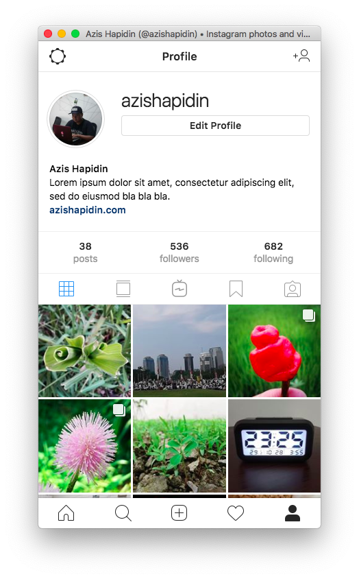

# instagram-electron
This is an example of implementation `loadURL()` and `webContents.setUserAgent()` from `BrowserWindow` class.

## To Use
To clone and run this repository you'll need [Git](https://git-scm.com) and [Node.js](https://nodejs.org/en/download/) (which comes with [npm](http://npmjs.com)) installed on your computer. From your command line:

```bash
# Clone this repository
git clone https://github.com/azishapidin/instagram-electron

# Go into the repository
cd instagram-electron

# Install dependencies
npm install

# Run the app
npm start
```

## Screenshot

<div style="text-align: center;">

</div>

## Note

This repo is cloned and modified from [https://github.com/electron/electron-quick-start](https://github.com/electron/electron-quick-start)